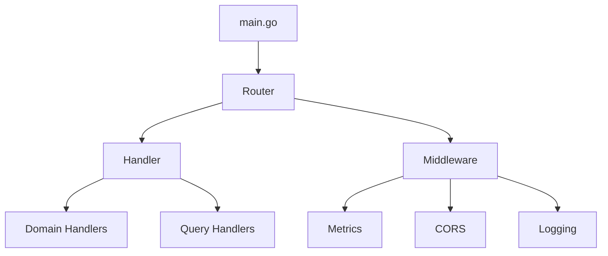

# ルーティング実装説明書

## 📖 **概要**

本ドキュメントでは、backend-apiにおけるルーティング管理システムの実装について詳細に説明します。oapi-codegenを活用したクリーンアーキテクチャベースの設計により、保守性と拡張性を両立したルーティングシステムを実現しています。

## 🎯 **実装の背景と目的**

### **従来の課題**

- 手動ルーティング管理による保守コストの増大
- API仕様とコードの不整合リスク
- 責務が混在した構造による拡張性の低下
- テストの困難さ

### **解決アプローチ**

- **oapi-codegen**: OpenAPI仕様からの自動コード生成
- **クリーンアーキテクチャ**: 責務分離による保守性向上
- **依存性注入**: テスタビリティの向上
- **ミドルウェア統合**: 横断的関心事の一元管理

## 🏗️ **アーキテクチャ設計**

### **ディレクトリ構成**

```text
backend-api/
├── cmd/api/main.go                    # アプリケーションエントリーポイント
├── internal/shared/presentation/rest/
│   ├── router/router.go               # ルーティング統一管理
│   ├── handler/handler.go             # ハンドラー統合管理
│   ├── middleware/middleware.go       # ミドルウェア管理
│   └── openapi/                       # oapi-codegen生成コード
│       └── oapi-codegen-config.gen.go
```

### **責務分離の設計**



## 📋 **各コンポーネントの実装詳細**

### **1. router.go - ルーティング統一管理**

#### **責務**

- **ルーティング定義**: oapi-codegenの自動ルーティングを活用
- **ミドルウェア管理**: 共通ミドルウェアの統一適用
- **静的ファイル配信**: Swagger UI等の配信管理
- **拡張性**: 将来的なAPIバージョニング、gRPC対応準備

#### **実装のポイント**

```go
// oapi-codegenとの統合例
func SetupRouter(handler ServerInterface) *echo.Echo {
    e := echo.New()

    // ミドルウェアの統一適用
    setupMiddleware(e)

    // oapi-codegen自動ルーティング
    RegisterHandlers(e.Group("/api"), handler)

    // 静的ファイル配信
    setupStaticFiles(e)

    return e
}
```

#### **技術的メリット**

- **自動化**: ルーティング定義の手動管理からの解放
- **一貫性**: OpenAPI仕様との自動同期
- **型安全性**: コンパイル時の仕様違反検出

### **2. handler.go - ハンドラー統合管理**

#### **責務**

- **ハンドラー統合**: 各ドメインハンドラーの統合管理
- **依存性注入**: AWSサービス等の注入
- **型安全性**: oapi-codegen ServerInterfaceの実装

#### **実装のポイント**

```go
// ハンドラー統合の例
type Handler struct {
    *ProductHandler
    *CategoryHandler
    *HealthHandler
    // 各ドメインハンドラーの組み込み
}

// ServerInterfaceの実装
func (h *Handler) ListProducts(ctx echo.Context, params ListProductsParams) error {
    return h.ProductHandler.ListProducts(ctx, params)
}
```

#### **設計思想**

- **単一責任原則**: ハンドラー管理のみに特化
- **開放閉鎖原則**: 新しいハンドラーの追加が容易
- **依存性逆転**: インターフェースベースの設計

### **3. main.go - アプリケーション起動**

#### **責務**

- **設定初期化**: データベース、AWS等の初期化
- **ルーター委譲**: ルーティング処理をrouter.goに委譲
- **ライフサイクル管理**: グレースフルシャットダウン等

#### **実装のポイント**

```go
func main() {
    // 設定とサービスの初期化
    config := initializeConfig()
    services := initializeServices(config)

    // ハンドラーとルーターの設定
    handler := NewHandler(services)
    router := SetupRouter(handler)

    // サーバー起動とライフサイクル管理
    startServerWithGracefulShutdown(router)
}
```

### **4. middleware.go - 横断的関心事の管理**

#### **責務**

- **共通処理**: 認証、ログ、メトリクス等
- **拡張性**: 新しいミドルウェアの追加容易性
- **設定管理**: 環境別のミドルウェア設定

#### **実装例**

```go
func SetupMiddleware(e *echo.Echo) {
    // 基本ミドルウェア
    e.Use(middleware.Recover())
    e.Use(middleware.RequestID())
    e.Use(middleware.Logger())
    e.Use(middleware.CORS())

    // 拡張ミドルウェア（将来実装）
    // e.Use(MetricsMiddleware())
    // e.Use(RateLimitMiddleware())
}
```

## 🎯 **oapi-codegen活用の技術的メリット**

### **1. API仕様の一貫性**

- OpenAPI仕様ファイルが単一真実源となる
- 仕様変更時の自動コード同期
- フロントエンドとの型定義共有

### **2. 型安全性の向上**

- コンパイル時のAPI仕様違反検出
- パラメーターバインディングの自動化
- レスポンス型の保証

### **3. 開発効率の向上**

- 手動ルーティング実装の削減
- ボイラープレートコードの自動生成
- テストコードの簡素化

### **4. 保守性の向上**

- 仕様変更時の影響範囲明確化
- ドキュメントとコードの自動同期
- リファクタリングの安全性向上

## 🔄 **クリーンアーキテクチャの実装**

### **依存関係の方向**

```text
main.go → router.go → handler.go → domain layers
```

### **原則の適用**

- **単一責任原則**: 各コンポーネントが明確な責務を持つ
- **開放閉鎖原則**: 拡張に開かれ、修正に閉じている
- **依存性逆転**: 具象ではなく抽象に依存
- **インターフェース分離**: 必要な機能のみを公開

### **層の分離**

- **Presentation層**: ルーティング、ハンドラー
- **Application層**: ユースケース、サービス
- **Domain層**: ビジネスロジック、エンティティ
- **Infrastructure層**: データベース、外部サービス

## 🚀 **拡張性への対応**

### **APIバージョニング**

```go
// 将来のバージョニング対応例
func SetupVersionedRouting(e *echo.Echo, handlers map[string]ServerInterface) {
    for version, handler := range handlers {
        group := e.Group(fmt.Sprintf("/api/%s", version))
        RegisterHandlers(group, handler)
    }
}
```

### **プロトコル拡張**

- **gRPC**: 別途grpcサーバーとの統合準備
- **GraphQL**: resolverとの統合可能性
- **WebSocket**: リアルタイム通信対応

### **ミドルウェア拡張**

- **メトリクス収集**: Prometheus統合
- **分散トレーシング**: Jaeger/X-Ray統合
- **レート制限**: Redis統合

## 📊 **パフォーマンスへの配慮**

### **最適化ポイント**

- **ルーティング効率**: Echo高速ルーターの活用
- **メモリ使用量**: ハンドラー共有による最適化
- **コンパイル時最適化**: oapi-codegenによる型安全性

### **スケーラビリティ**

- **水平スケーリング**: ステートレス設計
- **ロードバランシング**: 複数インスタンス対応
- **キャッシュ戦略**: Redis統合準備

## 🧪 **テスタビリティ**

### **テスト戦略**

- **単体テスト**: 各ハンドラーの独立テスト
- **統合テスト**: ルーティング全体のテスト
- **契約テスト**: OpenAPI仕様との整合性テスト

### **モック活用**

```go
// テスト例
func TestHandler(t *testing.T) {
    mockService := &MockProductService{}
    handler := NewHandler(mockService)

    // テスト実行
    // ...
}
```

## 📚 **関連技術とベストプラクティス**

### **使用技術スタック**

- **Echo**: 高性能HTTPフレームワーク
- **oapi-codegen**: OpenAPIコード生成
- **SQLBoiler**: 型安全ORM
- **Viper**: 設定管理

### **開発ベストプラクティス**

- **OpenAPI First**: 仕様駆動開発
- **継続的インテグレーション**: 自動テスト・ビルド
- **コードレビュー**: 品質担保プロセス
- **ドキュメント管理**: 仕様とコードの同期

## 🔗 **関連ドキュメント**

- [アーキテクチャ設計書](../../docs/design/architecture.md)
- [オブザーバビリティ実装ガイド](./observability.md)
- [API仕様書](../openapi.yaml)
- [設計ドキュメント](../../docs/design/)
- [開発ガイドライン](../../docs/development-guidelines.md)

---

**対象読者**: バックエンド開発者、アーキテクト
**前提知識**: Go、REST API、クリーンアーキテクチャ
**更新方針**: 実装変更時に随時更新
