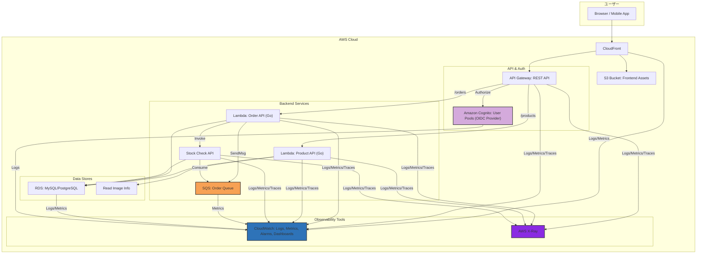

# 1. アーキテクチャ設計と技術スタック (MVP)

## 1.1. 目次

- [1. アーキテクチャ設計と技術スタック (MVP)](#1-アーキテクチャ設計と技術スタック-mvp)
  - [1.1. 目次](#11-目次)
  - [1.2. はじめに](#12-はじめに)
    - [1.2.1. 目的](#121-目的)
    - [1.2.2. スコープ](#122-スコープ)
  - [1.3. アーキテクチャ設計 (MVP概要レベル)](#13-アーキテクチャ設計-mvp概要レベル)
  - [1.4. 技術スタック (MVP)](#14-技術スタック-mvp)
  - [1.5. 技術選定理由 (主要なもの)](#15-技術選定理由-主要なもの)
  - [1.6. 今後の拡張性 (Release 2以降)](#16-今後の拡張性-release-2以降)

## 1.2. はじめに

### 1.2.1. 目的

この文書は、「AWSオブザーバビリティ学習用eコマースアプリ」プロジェクトの Minimum Viable Product (MVP) 時点におけるアーキテクチャ設計（概要レベル）と、採用する技術スタックを定義します。主目的であるAWSオブザーバビリティの学習効果を最大化しつつ、実現可能なスコープを設定することを目指します。

### 1.2.2. スコープ

本文書はMVPリリースに焦点を当てます。基本的なeコマース機能（商品閲覧、カート、注文、基本管理）と、それを支えるAWSインフラ、そしてオブザーバビリティ（ログ、メトリクス、トレース）の基本的な収集・利用環境を対象とします。

## 1.3. アーキテクチャ設計 (MVP概要レベル)

以下の図は、MVP時点での主要コンポーネントと基本的な連携、およびオブザーバビリティデータの流れを示します。

**主要な流れとポイント:**

1. **フロントエンド:** Next.jsで構築されたSPAはS3に配置され、CloudFront経由で配信されます。
2. **API:** クライアントからのリクエストはAPI Gatewayが受け付けます。認証が必要なAPIはCognito User Poolsで認証されます。
3. **バックエンドロジック:**
    - 商品情報の取得などはLambda (`Lambda_Product`) が担当し、RDSからデータを取得します。
    - 注文リクエストはLambda (`Lambda_Order`) が受け付け、基本的な処理を行った後、詳細処理（在庫引き当てなど）のためにSQSにメッセージを送信します。また、在庫確認のために同期的にFargateサービスを呼び出すことも想定します。
    - 在庫管理や非同期注文処理などの状態を持つ、または常時稼働が望ましいロジックはFargate (`Fargate_Stock`) 上のGoアプリケーションが担当し、SQSからメッセージを受け取ったり、Lambdaから直接呼び出されたりして、RDSの在庫情報を更新します。
4. **データストア:** 主要なデータ（商品、顧客、注文）はRDSに格納します。商品画像などはS3に保存します。
5. **認証:** 顧客および管理者の認証はCognitoで行います。Cognito User PoolsはOIDCプロバイダーとしても機能し、標準的な認証フローを提供します。（ソーシャルログインはRelease 2以降で検討）
6. **オブザーバビリティ (MVP):**
    - **ログ:** 各コンポーネント（CloudFront, API Gateway, Lambda, Fargate, RDS, Cognito）のログはCloudWatch Logsに集約されます。アプリケーションログは構造化（JSON）形式で出力します。
    - **メトリクス:** 各サービスの標準メトリクスと、EMF（Embedded Metric Format）を利用したカスタムメトリクスがCloudWatch Metricsに収集されます。
    - **トレース:** API Gateway, Lambda, Fargate間のリクエストはX-Rayでトレースされ、サービスマップやトレース詳細が確認できます。
    - **監視・アラート:** CloudWatch Dashboardで主要メトリクスを可視化し、CloudWatch Alarmで基本的な異常（エラー率、レイテンシ、リソース使用率）を検知して通知します。

## 1.4. 技術スタック (MVP)

MVP時点で採用する主要な技術スタック、および将来的に検討する技術スタックは以下の通りです。

| カテゴリ                 | 技術/サービス                                | ステータス | 主な用途・特徴 (MVP / 将来)                                          |
| :----------------------- | :------------------------------------------- | :--------: | :------------------------------------------------------------------- |
| **フロントエンド**       | Next.js                                      |     ✅      | ReactベースSPA構築、SSR/SSG対応                                      |
|                          | TypeScript                                   |     ✅      | 静的型付け                                                           |
|                          | React                                        |     ✅      | UIコンポーネントライブラリ                                           |
|                          | TailwindCSS                                  |     ✅      | ユーティリティファーストCSS                                          |
|                          | S3 + CloudFront                              |     ✅      | 静的アセットホスティング・配信                                       |
| **API管理・認証**        | API Gateway (REST API)                       |     ✅      | APIエンドポイント提供、リクエストルーティング、認証連携              |
|                          | Amazon Cognito (User Pools - OIDC Provider)  |     ✅      | ユーザー（顧客・管理者）認証・管理基盤、OIDC準拠                     |
|                          | Application Load Balancer (ALB)              |     ❌      | (将来) マイクロサービス間の内部ルーティングや高度な認証連携          |
| **コンピューティング**   | Lambda (Go)                                  |     ✅      | APIバックエンド、イベント処理（注文受付、商品取得など）              |
|                          | Fargate (ECS) (Go)                           |     ✅      | コンテナ実行環境（在庫管理サービス、非同期処理など）                 |
| **データストア**         | RDS (MySQL or PostgreSQL)                    |     ✅      | リレーショナルデータベース（商品、顧客、注文データ）                 |
|                          | DynamoDB                                     |     ❌      | (将来) 高スケーラブルなデータ処理（カート情報、セッション管理等）    |
| **ストレージ**           | S3                                           |     ✅      | オブジェクトストレージ（商品画像など）                               |
| **メッセージング**       | SQS                                          |     ✅      | メッセージキュー（非同期処理連携: 例 注文処理）                      |
|                          | SNS                                          |     ❌      | (将来) パブリッシュ/サブスクライブ型通知、イベントファンアウト       |
|                          | EventBridge                                  |     ❌      | (将来) イベント駆動アーキテクチャの中核、サービス間連携              |
| **通知**                 | SES                                          |     ❌      | (将来) Eメール送信（注文確認、パスワードリセット等 - MVPは簡易実装） |
| **オブザーバビリティ**   | **CloudWatch Logs**                          |     ✅      | ログ集約・検索（構造化ログ推奨）                                     |
|                          | **CloudWatch Metrics** (標準 + EMFカスタム)  |     ✅      | メトリクス収集・可視化                                               |
|                          | **CloudWatch Alarms**                        |     ✅      | 基本的な閾値監視とアラート通知                                       |
|                          | **CloudWatch Dashboards**                    |     ✅      | 基本的なシステムヘルス・主要メトリクスの可視化                       |
|                          | **AWS X-Ray** (SDK for Go)                   |     ✅      | 分散トレーシング                                                     |
|                          | CloudWatch Synthetics                        |     ❌      | (将来) エンドツーエンドのユーザーフロー監視、API監視                 |
|                          | DevOps Guru                                  |     ❌      | (将来) ML駆動の異常検出と問題の自動診断                              |
|                          | Amazon Managed Service for Prometheus (AMP)  |     ❌      | (将来) Prometheus形式の高度なメトリクス収集とクエリ                  |
|                          | Amazon Managed Grafana (AMG)                 |     ❌      | (将来) 高度なダッシュボードと可視化 (Prometheus, CloudWatch連携)     |
|                          | AWS Distro for OpenTelemetry (ADOT)          |     ⚪️      | (将来/Option) 標準化されたテレメトリデータ収集、OTel SDK連携         |
|                          | CloudTrail                                   |     ⚪️      | (将来) AWS API呼び出しの監査とコンプライアンス                       |
|                          | AWS Config                                   |     ⚪️      | (将来) インフラ構成変更の追跡、コンプライアンスチェック              |
|                          | OpenSearch Service                           |     ❌      | (将来) 大規模ログデータの高度な検索、分析、可視化                    |
|                          | Athena                                       |     ❌      | (将来) S3上のログデータ等へのアドホックSQLクエリ分析                 |
|                          | VPC Flow Logs                                |     ❌      | (将来) ネットワークトラフィックの可視化、セキュリティ分析            |
|                          | Fault Injection Service (FIS)                |     ❌      | (将来) カオスエンジニアリング、レジリエンステスト                    |
|                          | CloudWatch RUM                               |     ⚪️      | (将来/Option) 実ユーザー体験（Web Vitals等）とパフォーマンス測定     |
|                          | AWS Health Dashboard                         |     ❌      | (将来) AWSサービス自体のヘルスステータス監視                         |
| **バックエンド言語・FW** | Go                                           |     ✅      | バックエンド開発言語 (Lambda, Fargate)                               |
|                          | Echo                                         |     ✅      | Go言語Webフレームワーク                                              |
|                          | **Bob**                                      |     ✅      | Go言語ORM (メンテナンス中のsqlboilerの代替)                          |
|                          | slog                                         |     ✅      | Go標準構造化ロギング                                                 |
|                          | OpenAPI/oapi-codegen                         |     ✅      | APIスキーマ定義・コード生成                                          |
|                          | golang-migrate                               |     ✅      | DBスキーママイグレーション管理                                       |
| **開発・運用基盤**       | Docker / Docker Compose                      |     ✅      | コンテナ化、ローカル環境構築                                         |
|                          | LocalStack                                   |     ✅      | ローカルAWSエミュレーション (`awslocal` CLIで操作)                   |
|                          | Terraform                                    |     ✅      | Infrastructure as Code (`tflocal`ラッパーでLocalStack連携)           |
|                          | GitHub Actions                               |     ✅      | CI/CDパイプライン (テスト、ビルド、デプロイ)                         |
|                          | air                                          |     ✅      | Go開発時のホットリロード                                             |
| **OAuth連携**            | Cognito Hosted UI / Social Identity Provider |     ⚪️      | (将来/Option) ソーシャルログイン連携                                 |

**凡例:** ✅=MVP採用, ⚪️=MVP以降で検討/Option, ❌=MVP不採用

## 1.5. 技術選定理由 (主要なもの)

- **API Gateway + Lambda + Fargate + SQS:** (変更なし)
- **Go言語:** (変更なし)
- **Bob (ORM):** メンテナンス中の `sqlboiler` の代替として推奨されており、コード生成ベースで型安全なDBアクセスを提供するため。
- **RDS:** (変更なし)
- **Cognito:** (変更なし、OIDCサポートも含む)
- **AWSネイティブオブザーバビリティ (CloudWatch Logs/Metrics/X-Ray):** (変更なし)
- **Terraform + LocalStack + tflocal:** (変更なし)
- **GitHub Actions:** (変更なし)

## 1.6. 今後の拡張性 (Release 2以降)

MVPを基盤として、上記技術スタック表で ⚪️ や ❌ となっている技術要素の導入・拡張を検討します。特にオブザーバビリティ関連では、RUM, Synthetics, CloudTrail, Config, ADOT(OpenTelemetry), FISなどを段階的に導入し、学習を進めることができます。アーキテクチャ面では、EventBridgeやSNSを活用したイベント駆動設計の強化、DynamoDBの導入などが考えられます。

- **オブザーバビリティ:** CloudWatch RUM, Synthetics, CloudTrail, AWS Config, OpenTelemetry(ADOT), Managed Grafana/Prometheus, DevOps Guru, Fault Injection Serviceなど。
- **アーキテクチャ:** EventBridge, SNS, SESによるイベント駆動連携の強化、DynamoDBの活用、マイクロサービスのさらなる分割、サービスメッシュ（App Meshなど）の検討。
- **機能:** ソーシャルログイン、高度な検索(OpenSearch)、レコメンデーション、より詳細なBI分析(QuickSight)など。
