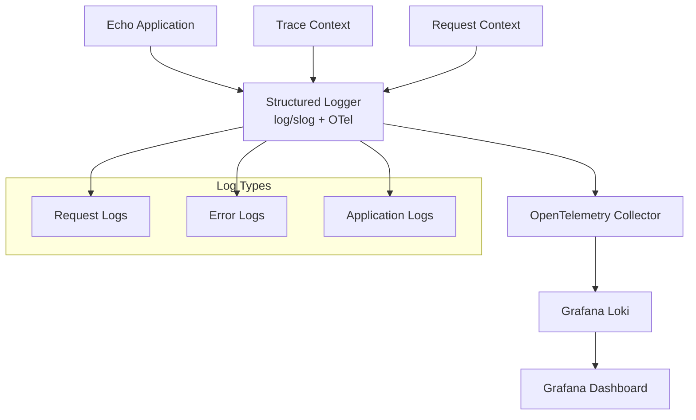

# 構造化ログ設計書

## 📋 ドキュメント情報

| 項目                   | 内容                                                   |
| ---------------------- | ------------------------------------------------------ |
| タイトル               | Goバックエンドの構造化ログ出力設計 (OpenTelemetry連携) |
| バージョン             | v1.0                                                   |
| 作成日                 | 2025-06-05                                             |
| 対象システム           | aws-observability-ecommerce                            |
| 関連ユーザーストーリー | US-DEV-OBS-IMPLEMENT-STRUCTURED-LOGGING                |

## 🎯 1. 設計概要

### 1.1 目的

Goバックエンド(Echo)アプリケーションに構造化ログ機能を実装し、OpenTelemetry Collector経由でGrafana Lokiに転送することで、効率的なログ検索・分析・監視体制を構築する。

### 1.2 設計原則

- **構造化**: JSON形式での一貫したログフォーマット
- **標準化**: OpenTelemetryによるベンダー中立な実装
- **トレーサビリティ**: トレースIDとスパンIDの自動付与
- **パフォーマンス**: 非同期処理によるアプリケーション性能への影響最小化
- **運用性**: ログレベルの動的変更とコスト効率的な設定

### 1.3 アーキテクチャ概要



## 🏗️ 2. ログスキーマ設計

### 2.1 共通フィールド仕様

すべてのログエントリに含まれる共通フィールドを定義します。

```yaml
共通フィールド:
  # タイムスタンプ (必須)
  timestamp: "2025-06-05T10:30:45.123456789Z"  # RFC3339Nano形式

  # ログレベル (必須)
  level: "debug|info|warn|error"

  # メッセージ (必須)
  message: "Human readable log message"

  # サービス情報 (必須)
  service:
    name: "aws-observability-ecommerce"
    version: "1.0.0"
    environment: "development|staging|production"

  # トレーシング情報 (OpenTelemetry連携時)
  trace:
    trace_id: "4bf92f3577b34da6a3ce929d0e0e4736"  # 32文字16進数
    span_id: "00f067aa0ba902b7"                   # 16文字16進数
    flags: "01"                                    # トレースフラグ

  # リクエスト情報
  request:
    id: "req_abc123def456"                       # リクエスト固有ID (UUID v4)

  # ホスト情報
  host:
    name: "backend-api-container"                # コンテナ名/ホスト名
    ip: "172.18.0.3"                            # IP アドレス
```

### 2.2 ログタイプ別スキーマ

#### 2.2.1 リクエストログ

HTTPリクエストの処理情報を記録します。

```yaml
リクエストログスキーマ:
  # 共通フィールド + 以下の専用フィールド
  log_type: "request"

  # HTTP詳細情報
  http:
    method: "GET|POST|PUT|DELETE|PATCH|HEAD|OPTIONS"
    path: "/api/products/123"                    # パスパラメータ含む
    query: "category=electronics&limit=10"       # クエリパラメータ
    status_code: 200                             # HTTPステータスコード
    request_size_bytes: 1024                     # リクエストボディサイズ
    response_size_bytes: 2048                    # レスポンスボディサイズ
    duration_ms: 45.23                          # 処理時間(ミリ秒)
    user_agent: "Mozilla/5.0 (Windows NT 10.0; Win64; x64) AppleWebKit/537.36"
    remote_ip: "192.168.1.100"                  # クライアントIPアドレス
    x_forwarded_for: "203.0.113.195, 70.41.3.18" # プロキシ経由の場合
    referer: "https://customer.localhost/products" # リファラ
    content_type: "application/json"             # Content-Type
    accept: "application/json"                   # Accept ヘッダー

  # 認証情報 (認証済みの場合)
  user:
    id: "user_12345"                            # ユーザーID
    session_id: "sess_abc123def456"             # セッションID
    role: "customer|admin|manager"              # ユーザーロール

  # レスポンス詳細
  response:
    cache_hit: true                             # キャッシュヒット有無
    database_queries: 3                         # 実行されたDBクエリ数
    external_api_calls: 1                       # 外部API呼び出し数
```

#### 2.2.2 エラーログ

アプリケーションエラーの詳細情報を記録します。

```yaml
エラーログスキーマ:
  # 共通フィールド + 以下の専用フィールド
  log_type: "error"

  # エラー詳細情報
  error:
    type: "DatabaseConnectionError"             # エラータイプ
    message: "connection refused: mysql:3306"   # エラーメッセージ
    code: "DB_CONN_REFUSED"                    # アプリケーション独自エラーコード
    stack_trace: |                             # スタックトレース
      main.go:45 -> database.go:123 -> connection.go:67
      github.com/y-nosuke/aws-observability-ecommerce/internal/shared/infrastructure/database.InitDatabase
      github.com/y-nosuke/aws-observability-ecommerce/cmd/api.main
    fingerprint: "db_connection_mysql_3306"    # エラーグルーピング用フィンガープリント

  # コンテキスト情報
  context:
    operation: "product_fetch"                  # 実行していた操作
    resource_type: "product"                    # 対象リソースタイプ
    resource_id: "123"                         # 対象リソースID
    retry_count: 2                             # リトライ回数（該当する場合）
    max_retries: 3                             # 最大リトライ数
    timeout_ms: 5000                           # タイムアウト値

  # 影響範囲
  impact:
    severity: "critical|high|medium|low"        # 影響度
    affected_users: 15                         # 影響を受けたユーザー数（推定）
    business_impact: "checkout_blocked"        # ビジネスへの影響
```

#### 2.2.3 アプリケーションログ

ビジネスロジックの実行状況を記録します。

```yaml
アプリケーションログスキーマ:
  # 共通フィールド + 以下の専用フィールド
  log_type: "application"

  # 操作情報
  operation:
    name: "upload_product_image"                # 操作名
    category: "product_management"              # 操作カテゴリ
    duration_ms: 1200.45                       # 操作時間
    success: true                              # 操作成功可否
    stage: "validation|processing|storage|completion" # 処理ステージ

  # ビジネスコンテキスト
  business:
    entity_type: "product"                      # エンティティタイプ
    entity_id: "prod_123"                      # エンティティID
    action: "create|update|delete|view"        # アクション
    source: "admin_ui|api|batch_job"           # 操作元

  # データ詳細 (操作内容に応じて)
  data:
    image_size_bytes: 2048576                  # 画像サイズ（画像操作の場合）
    image_format: "jpeg"                       # 画像フォーマット
    s3_key: "products/prod_123/image_001.jpg"  # S3キー
    file_count: 3                              # ファイル数
    batch_size: 100                            # バッチサイズ

  # パフォーマンス詳細
  performance:
    db_query_duration_ms: 45.12               # DB クエリ時間
    s3_upload_duration_ms: 890.12             # S3 アップロード時間
    image_processing_duration_ms: 310.33      # 画像処理時間
    cache_lookup_duration_ms: 2.5             # キャッシュ検索時間
    memory_usage_mb: 128.5                    # メモリ使用量
```

## 🔧 3. 技術実装設計

### 3.1 依存関係

#### 3.1.1 Go Modules追加

```go
// go.mod に追加する依存関係
require (
    // OpenTelemetry Core
    go.opentelemetry.io/otel v1.30.0
    go.opentelemetry.io/otel/sdk v1.30.0
    go.opentelemetry.io/otel/trace v1.30.0

    // OpenTelemetry Logging
    go.opentelemetry.io/otel/log v0.5.0
    go.opentelemetry.io/otel/sdk/log v0.5.0

    // OTLP Exporters
    go.opentelemetry.io/otel/exporters/otlp/otlplog/otlploghttp v0.5.0
    go.opentelemetry.io/otel/exporters/otlp/otlptrace/otlptracehttp v1.30.0

    // OTel Instrumentation
    go.opentelemetry.io/contrib/instrumentation/github.com/labstack/echo/otelecho v0.55.0
    go.opentelemetry.io/contrib/bridges/otelslog v0.5.0

    // Additional utilities
    github.com/google/uuid v1.6.0  // Request ID generation
)
```

### 3.2 設定構造体

#### 3.2.1 設定ファイル拡張

```yaml
# config.yaml に追加
observability:
  logging:
    level: "info"                              # debug, info, warn, error
    format: "json"                             # json, text (開発時はtext推奨)
    enable_otel: true                          # OpenTelemetry連携有効化
    enable_trace_context: true                # トレースコンテキスト埋め込み
    max_log_size_mb: 100                      # 単一ログファイル最大サイズ

  otel:
    service_name: "aws-observability-ecommerce"
    service_version: "1.0.0"
    service_namespace: "ecommerce"
    deployment_environment: "development"      # development, staging, production

    collector:
      endpoint: "http://otel-collector:4318"   # OTLP HTTP endpoint
      timeout: "10s"
      retry_enabled: true
      retry_max_attempts: 3
      retry_initial_interval: "1s"
      retry_max_interval: "30s"
      compression: "gzip"

    tracing:
      enabled: true
      sample_rate: 1.0                         # 開発: 1.0, 本番: 0.1-0.01
      max_attributes_per_span: 128
      max_events_per_span: 128

    logging:
      batch_timeout: "1s"
      max_queue_size: 2048
      max_export_batch_size: 512
      export_timeout: "30s"
```

#### 3.2.2 Go設定構造体

```go
// internal/shared/infrastructure/config/observability_config.go
package config

import "time"

type ObservabilityConfig struct {
    Logging LoggingConfig `mapstructure:"logging"`
    OTel    OTelConfig    `mapstructure:"otel"`
}

type LoggingConfig struct {
    Level              string `mapstructure:"level"`
    Format             string `mapstructure:"format"`
    EnableOTel         bool   `mapstructure:"enable_otel"`
    EnableTraceContext bool   `mapstructure:"enable_trace_context"`
    MaxLogSizeMB       int    `mapstructure:"max_log_size_mb"`
}

type OTelConfig struct {
    ServiceName            string        `mapstructure:"service_name"`
    ServiceVersion         string        `mapstructure:"service_version"`
    ServiceNamespace       string        `mapstructure:"service_namespace"`
    DeploymentEnvironment  string        `mapstructure:"deployment_environment"`
    Collector              CollectorConfig `mapstructure:"collector"`
    Tracing                TracingConfig   `mapstructure:"tracing"`
    Logging                OTelLoggingConfig `mapstructure:"logging"`
}

type CollectorConfig struct {
    Endpoint               string        `mapstructure:"endpoint"`
    Timeout                time.Duration `mapstructure:"timeout"`
    RetryEnabled           bool          `mapstructure:"retry_enabled"`
    RetryMaxAttempts       int           `mapstructure:"retry_max_attempts"`
    RetryInitialInterval   time.Duration `mapstructure:"retry_initial_interval"`
    RetryMaxInterval       time.Duration `mapstructure:"retry_max_interval"`
    Compression            string        `mapstructure:"compression"`
}

type TracingConfig struct {
    Enabled                bool    `mapstructure:"enabled"`
    SampleRate             float64 `mapstructure:"sample_rate"`
    MaxAttributesPerSpan   int     `mapstructure:"max_attributes_per_span"`
    MaxEventsPerSpan       int     `mapstructure:"max_events_per_span"`
}

type OTelLoggingConfig struct {
    BatchTimeout         time.Duration `mapstructure:"batch_timeout"`
    MaxQueueSize         int           `mapstructure:"max_queue_size"`
    MaxExportBatchSize   int           `mapstructure:"max_export_batch_size"`
    ExportTimeout        time.Duration `mapstructure:"export_timeout"`
}
```

### 3.3 コア実装

#### 3.3.1 構造化ロガー実装

```go
// internal/shared/infrastructure/logging/logger.go
package logging

import (
    "context"
    "log/slog"
    "os"

    "go.opentelemetry.io/otel/trace"
    "go.opentelemetry.io/contrib/bridges/otelslog"
    "github.com/y-nosuke/aws-observability-ecommerce/backend-api/internal/shared/infrastructure/config"
)

type Logger interface {
    Info(ctx context.Context, msg string, fields ...Field)
    Warn(ctx context.Context, msg string, fields ...Field)
    Error(ctx context.Context, msg string, err error, fields ...Field)
    Debug(ctx context.Context, msg string, fields ...Field)

    // 特定ログタイプ向けヘルパー
    LogRequest(ctx context.Context, req RequestLogData)
    LogError(ctx context.Context, err error, errorCtx ErrorContext)
    LogApplication(ctx context.Context, op ApplicationOperation)
}

type Field struct {
    Key   string
    Value interface{}
}

type StructuredLogger struct {
    slogger *slog.Logger
    config  config.LoggingConfig
}

func NewLogger(cfg config.ObservabilityConfig) (Logger, error) {
    var handler slog.Handler

    opts := &slog.HandlerOptions{
        Level: parseLogLevel(cfg.Logging.Level),
        AddSource: true,
    }

    if cfg.Logging.Format == "json" {
        handler = slog.NewJSONHandler(os.Stdout, opts)
    } else {
        handler = slog.NewTextHandler(os.Stdout, opts)
    }

    // OpenTelemetry ブリッジを使用
    if cfg.Logging.EnableOTel {
        handler = otelslog.NewHandler("aws-observability-ecommerce",
            otelslog.WithHandler(handler))
    }

    logger := &StructuredLogger{
        slogger: slog.New(handler),
        config:  cfg.Logging,
    }

    return logger, nil
}

func (l *StructuredLogger) Info(ctx context.Context, msg string, fields ...Field) {
    l.log(ctx, slog.LevelInfo, msg, fields...)
}

func (l *StructuredLogger) Warn(ctx context.Context, msg string, fields ...Field) {
    l.log(ctx, slog.LevelWarn, msg, fields...)
}

func (l *StructuredLogger) Error(ctx context.Context, msg string, err error, fields ...Field) {
    allFields := append(fields, Field{Key: "error", Value: err.Error()})
    l.log(ctx, slog.LevelError, msg, allFields...)
}

func (l *StructuredLogger) Debug(ctx context.Context, msg string, fields ...Field) {
    l.log(ctx, slog.LevelDebug, msg, fields...)
}

func (l *StructuredLogger) log(ctx context.Context, level slog.Level, msg string, fields ...Field) {
    attrs := make([]slog.Attr, 0, len(fields)+10) // 余裕を持ったサイズ

    // 共通フィールドを追加
    attrs = append(attrs, l.buildCommonFields(ctx)...)

    // カスタムフィールドを追加
    for _, field := range fields {
        attrs = append(attrs, slog.Any(field.Key, field.Value))
    }

    l.slogger.LogAttrs(ctx, level, msg, attrs...)
}

func (l *StructuredLogger) buildCommonFields(ctx context.Context) []slog.Attr {
    attrs := []slog.Attr{
        slog.Group("service",
            slog.String("name", config.App.Name),
            slog.String("version", config.App.Version),
            slog.String("environment", config.App.Environment),
        ),
    }

    // トレースコンテキストを追加
    if l.config.EnableTraceContext {
        if traceCtx := l.extractTraceContext(ctx); traceCtx.TraceID != "" {
            attrs = append(attrs, slog.Group("trace",
                slog.String("trace_id", traceCtx.TraceID),
                slog.String("span_id", traceCtx.SpanID),
                slog.String("flags", traceCtx.Flags),
            ))
        }
    }

    // リクエストIDを追加
    if reqID := extractRequestID(ctx); reqID != "" {
        attrs = append(attrs, slog.Group("request",
            slog.String("id", reqID),
        ))
    }

    // ホスト情報を追加
    if hostname, _ := os.Hostname(); hostname != "" {
        attrs = append(attrs, slog.Group("host",
            slog.String("name", hostname),
        ))
    }

    return attrs
}

type TraceContext struct {
    TraceID string
    SpanID  string
    Flags   string
}

func (l *StructuredLogger) extractTraceContext(ctx context.Context) TraceContext {
    span := trace.SpanFromContext(ctx)
    if !span.SpanContext().IsValid() {
        return TraceContext{}
    }

    spanCtx := span.SpanContext()
    return TraceContext{
        TraceID: spanCtx.TraceID().String(),
        SpanID:  spanCtx.SpanID().String(),
        Flags:   spanCtx.TraceFlags().String(),
    }
}

func parseLogLevel(level string) slog.Level {
    switch level {
    case "debug":
        return slog.LevelDebug
    case "info":
        return slog.LevelInfo
    case "warn":
        return slog.LevelWarn
    case "error":
        return slog.LevelError
    default:
        return slog.LevelInfo
    }
}
```

#### 3.3.2 専用ログタイプ実装

```go
// internal/shared/infrastructure/logging/request_log.go
package logging

import (
    "context"
    "time"
)

type RequestLogData struct {
    Method           string
    Path             string
    Query            string
    StatusCode       int
    RequestSize      int64
    ResponseSize     int64
    Duration         time.Duration
    UserAgent        string
    RemoteIP         string
    XForwardedFor    string
    Referer          string
    ContentType      string
    Accept           string
    UserID           string
    SessionID        string
    UserRole         string
    CacheHit         bool
    DatabaseQueries  int
    ExternalAPICalls int
}

func (l *StructuredLogger) LogRequest(ctx context.Context, req RequestLogData) {
    fields := []Field{
        {Key: "log_type", Value: "request"},
        {Key: "http", Value: map[string]interface{}{
            "method":              req.Method,
            "path":                req.Path,
            "query":               req.Query,
            "status_code":         req.StatusCode,
            "request_size_bytes":  req.RequestSize,
            "response_size_bytes": req.ResponseSize,
            "duration_ms":         float64(req.Duration.Nanoseconds()) / 1e6,
            "user_agent":          req.UserAgent,
            "remote_ip":           req.RemoteIP,
            "x_forwarded_for":     req.XForwardedFor,
            "referer":             req.Referer,
            "content_type":        req.ContentType,
            "accept":              req.Accept,
        }},
        {Key: "response", Value: map[string]interface{}{
            "cache_hit":           req.CacheHit,
            "database_queries":    req.DatabaseQueries,
            "external_api_calls":  req.ExternalAPICalls,
        }},
    }

    if req.UserID != "" {
        fields = append(fields, Field{Key: "user", Value: map[string]interface{}{
            "id":         req.UserID,
            "session_id": req.SessionID,
            "role":       req.UserRole,
        }})
    }

    l.Info(ctx, "HTTP request processed", fields...)
}

// internal/shared/infrastructure/logging/error_log.go
type ErrorContext struct {
    Operation      string
    ResourceType   string
    ResourceID     string
    RetryCount     int
    MaxRetries     int
    TimeoutMs      int
    Severity       string
    AffectedUsers  int
    BusinessImpact string
}

func (l *StructuredLogger) LogError(ctx context.Context, err error, errorCtx ErrorContext) {
    fields := []Field{
        {Key: "log_type", Value: "error"},
        {Key: "error", Value: map[string]interface{}{
            "type":        getErrorType(err),
            "message":     err.Error(),
            "code":        getErrorCode(err),
            "stack_trace": getStackTrace(err),
            "fingerprint": generateErrorFingerprint(err, errorCtx),
        }},
        {Key: "context", Value: map[string]interface{}{
            "operation":     errorCtx.Operation,
            "resource_type": errorCtx.ResourceType,
            "resource_id":   errorCtx.ResourceID,
            "retry_count":   errorCtx.RetryCount,
            "max_retries":   errorCtx.MaxRetries,
            "timeout_ms":    errorCtx.TimeoutMs,
        }},
        {Key: "impact", Value: map[string]interface{}{
            "severity":        errorCtx.Severity,
            "affected_users":  errorCtx.AffectedUsers,
            "business_impact": errorCtx.BusinessImpact,
        }},
    }

    l.Error(ctx, "Application error occurred", err, fields...)
}

// internal/shared/infrastructure/logging/application_log.go
type ApplicationOperation struct {
    Name             string
    Category         string
    Duration         time.Duration
    Success          bool
    Stage            string
    EntityType       string
    EntityID         string
    Action           string
    Source           string
    Data             map[string]interface{}
    PerformanceData  map[string]interface{}
}

func (l *StructuredLogger) LogApplication(ctx context.Context, op ApplicationOperation) {
    fields := []Field{
        {Key: "log_type", Value: "application"},
        {Key: "operation", Value: map[string]interface{}{
            "name":        op.Name,
            "category":    op.Category,
            "duration_ms": float64(op.Duration.Nanoseconds()) / 1e6,
            "success":     op.Success,
            "stage":       op.Stage,
        }},
        {Key: "business", Value: map[string]interface{}{
            "entity_type": op.EntityType,
            "entity_id":   op.EntityID,
            "action":      op.Action,
            "source":      op.Source,
        }},
    }

    if len(op.Data) > 0 {
        fields = append(fields, Field{Key: "data", Value: op.Data})
    }

    if len(op.PerformanceData) > 0 {
        fields = append(fields, Field{Key: "performance", Value: op.PerformanceData})
    }

    message := "Application operation completed"
    if !op.Success {
        message = "Application operation failed"
    }

    l.Info(ctx, message, fields...)
}
```

#### 3.3.3 Echoミドルウェア実装

```go
// internal/shared/presentation/rest/middleware/logging_middleware.go
package middleware

import (
    "bytes"
    "context"
    "io"
    "time"

    "github.com/google/uuid"
    "github.com/labstack/echo/v4"
    "github.com/y-nosuke/aws-observability-ecommerce/backend-api/internal/shared/infrastructure/logging"
)

const RequestIDKey = "request_id"

func RequestIDMiddleware() echo.MiddlewareFunc {
    return func(next echo.HandlerFunc) echo.HandlerFunc {
        return func(c echo.Context) error {
            requestID := c.Request().Header.Get("X-Request-ID")
            if requestID == "" {
                requestID = "req_" + uuid.New().String()
            }

            // コンテキストにリクエストIDを設定
            ctx := context.WithValue(c.Request().Context(), RequestIDKey, requestID)
            c.SetRequest(c.Request().WithContext(ctx))

            // レスポンスヘッダーにも設定
            c.Response().Header().Set("X-Request-ID", requestID)

            return next(c)
        }
    }
}

func StructuredLoggingMiddleware(logger logging.Logger) echo.MiddlewareFunc {
    return func(next echo.HandlerFunc) echo.HandlerFunc {
        return func(c echo.Context) error {
            start := time.Now()

            // リクエストボディのサイズを取得
            var requestSize int64
            if c.Request().Body != nil {
                bodyBytes, _ := io.ReadAll(c.Request().Body)
                requestSize = int64(len(bodyBytes))
                c.Request().Body = io.NopCloser(bytes.NewBuffer(bodyBytes))
            }

            // レスポンスライターをラップしてサイズを追跡
            resWrapper := &responseWriter{ResponseWriter: c.Response().Writer}
            c.Response().Writer = resWrapper

            // 次のハンドラーを実行
            err := next(c)

            // ログデータを構築
            duration := time.Since(start)
            logData := logging.RequestLogData{
                Method:           c.Request().Method,
                Path:             c.Request().URL.Path,
                Query:            c.Request().URL.RawQuery,
                StatusCode:       c.Response().Status,
                RequestSize:      requestSize,
                ResponseSize:     resWrapper.size,
                Duration:         duration,
                UserAgent:        c.Request().UserAgent(),
                RemoteIP:         c.RealIP(),
                XForwardedFor:    c.Request().Header.Get("X-Forwarded-For"),
                Referer:          c.Request().Referer(),
                ContentType:      c.Request().Header.Get("Content-Type"),
                Accept:           c.Request().Header.Get("Accept"),
                // ユーザー情報は認証実装後に追加
                CacheHit:         false, // キャッシュ実装後に追加
                DatabaseQueries:  0,     // DB監視実装後に追加
                ExternalAPICalls: 0,     // 外部API監視実装後に追加
            }

            // リクエストログを出力
            logger.LogRequest(c.Request().Context(), logData)

            return err
        }
    }
}

type responseWriter struct {
    echo.ResponseWriter
    size int64
}

func (w *responseWriter) Write(b []byte) (int, error) {
    size, err := w.ResponseWriter.Write(b)
    w.size += int64(size)
    return size, err
}

func extractRequestID(ctx context.Context) string {
    if reqID, ok := ctx.Value(RequestIDKey).(string); ok {
        return reqID
    }
    return ""
}
```

### 3.4 OpenTelemetry初期化

```go
// internal/shared/infrastructure/observability/otel.go
package observability

import (
    "context"
    "time"

    "go.opentelemetry.io/otel"
    "go.opentelemetry.io/otel/exporters/otlp/otlplog/otlploghttp"
    "go.opentelemetry.io/otel/exporters/otlp/otlptrace/otlptracehttp"
    "go.opentelemetry.io/otel/sdk/log"
    "go.opentelemetry.io/otel/sdk/resource"
    "go.opentelemetry.io/otel/sdk/trace"
    semconv "go.opentelemetry.io/otel/semconv/v1.26.0"

    "github.com/y-nosuke/aws-observability-ecommerce/backend-api/internal/shared/infrastructure/config"
)

func InitOpenTelemetry(cfg config.OTelConfig) (func(), error) {
    ctx := context.Background()

    // リソース情報を作成
    res, err := resource.New(ctx,
        resource.WithAttributes(
            semconv.ServiceName(cfg.ServiceName),
            semconv.ServiceVersion(cfg.ServiceVersion),
            semconv.ServiceNamespace(cfg.ServiceNamespace),
            semconv.DeploymentEnvironment(cfg.DeploymentEnvironment),
        ),
    )
    if err != nil {
        return nil, err
    }

    // トレーシング初期化
    tracerShutdown, err := initTracing(ctx, cfg, res)
    if err != nil {
        return nil, err
    }

    // ログ初期化
    loggerShutdown, err := initLogging(ctx, cfg, res)
    if err != nil {
        tracerShutdown()
        return nil, err
    }

    // シャットダウン関数を返す
    return func() {
        loggerShutdown()
        tracerShutdown()
    }, nil
}

func initTracing(ctx context.Context, cfg config.OTelConfig, res *resource.Resource) (func(), error) {
    if !cfg.Tracing.Enabled {
        return func() {}, nil
    }

    // OTLP Trace Exporter
    traceExporter, err := otlptracehttp.New(ctx,
        otlptracehttp.WithEndpoint(cfg.Collector.Endpoint),
        otlptracehttp.WithTimeout(cfg.Collector.Timeout),
        otlptracehttp.WithCompression(otlptracehttp.GzipCompression),
    )
    if err != nil {
        return nil, err
    }

    // Trace Provider
    tp := trace.NewTracerProvider(
        trace.WithBatcher(traceExporter),
        trace.WithResource(res),
        trace.WithSampler(trace.TraceIDRatioBased(cfg.Tracing.SampleRate)),
    )

    otel.SetTracerProvider(tp)

    return func() {
        ctx, cancel := context.WithTimeout(context.Background(), 5*time.Second)
        defer cancel()
        tp.Shutdown(ctx)
    }, nil
}

func initLogging(ctx context.Context, cfg config.OTelConfig, res *resource.Resource) (func(), error) {
    // OTLP Log Exporter
    logExporter, err := otlploghttp.New(ctx,
        otlploghttp.WithEndpoint(cfg.Collector.Endpoint),
        otlploghttp.WithTimeout(cfg.Collector.ExportTimeout),
        otlploghttp.WithCompression(otlploghttp.GzipCompression),
    )
    if err != nil {
        return nil, err
    }

    // Log Provider
    lp := log.NewLoggerProvider(
        log.WithProcessor(log.NewBatchProcessor(logExporter,
            log.WithBatchTimeout(cfg.Logging.BatchTimeout),
            log.WithMaxQueueSize(cfg.Logging.MaxQueueSize),
            log.WithExportMaxBatchSize(cfg.Logging.MaxExportBatchSize),
            log.WithExportTimeout(cfg.Logging.ExportTimeout),
        )),
        log.WithResource(res),
    )

    otel.SetLoggerProvider(lp)

    return func() {
        ctx, cancel := context.WithTimeout(context.Background(), 5*time.Second)
        defer cancel()
        lp.Shutdown(ctx)
    }, nil
}
```

## 🐳 4. インフラ設定

### 4.1 Docker Compose拡張

```yaml
# compose.yml に追加
services:
  # 既存サービス...

  # OpenTelemetry Collector
  otel-collector:
    image: otel/opentelemetry-collector-contrib:0.113.0
    container_name: otel-collector
    restart: unless-stopped
    command: ["--config=/etc/otelcol/otel-collector.yaml"]
    volumes:
      - ./infra/otel/otel-collector.yaml:/etc/otelcol/otel-collector.yaml:ro
    ports:
      - "4317:4317"   # OTLP gRPC receiver
      - "4318:4318"   # OTLP HTTP receiver
      - "8889:8889"   # Prometheus metrics endpoint
    environment:
      - LOKI_ENDPOINT=http://loki:3100/loki/api/v1/push
    depends_on:
      loki:
        condition: service_healthy
    healthcheck:
      test: ["CMD", "wget", "--no-verbose", "--tries=1", "--spider", "http://localhost:13133/"]
      interval: 10s
      timeout: 5s
      retries: 3
      start_period: 10s
    labels:
      - "traefik.enable=false"
    networks:
      - ecommerce-network
    deploy:
      resources:
        limits:
          memory: 256M

  # Grafana Loki
  loki:
    image: grafana/loki:3.2.0
    container_name: loki
    restart: unless-stopped
    ports:
      - "3100:3100"
    command: -config.file=/etc/loki/local-config.yaml
    volumes:
      - ./infra/loki/loki.yaml:/etc/loki/local-config.yaml:ro
      - loki_data:/tmp/loki
    healthcheck:
      test: ["CMD", "wget", "--no-verbose", "--tries=1", "--spider", "http://localhost:3100/ready"]
      interval: 10s
      timeout: 5s
      retries: 3
      start_period: 15s
    labels:
      - "traefik.enable=false"
    networks:
      - ecommerce-network
    deploy:
      resources:
        limits:
          memory: 512M

  # Grafana
  grafana:
    image: grafana/grafana:11.3.0
    container_name: grafana
    restart: unless-stopped
    ports:
      - "3001:3000"  # ポート3000はfrontendと競合するため3001に変更
    environment:
      - GF_SECURITY_ADMIN_PASSWORD=admin
      - GF_SECURITY_ADMIN_USER=admin
      - GF_USERS_ALLOW_SIGN_UP=false
      - GF_LOGGING_LEVEL=info
    volumes:
      - ./infra/grafana/provisioning:/etc/grafana/provisioning:ro
      - ./infra/grafana/dashboards:/var/lib/grafana/dashboards:ro
      - grafana_data:/var/lib/grafana
    depends_on:
      loki:
        condition: service_healthy
    healthcheck:
      test: ["CMD", "wget", "--no-verbose", "--tries=1", "--spider", "http://localhost:3000/api/health"]
      interval: 10s
      timeout: 5s
      retries: 3
      start_period: 20s
    labels:
      - "traefik.enable=true"
      - "traefik.http.routers.grafana.rule=Host(`grafana.localhost`)"
      - "traefik.http.routers.grafana.entrypoints=web"
      - "traefik.http.services.grafana.loadbalancer.server.port=3000"
    networks:
      - ecommerce-network
    deploy:
      resources:
        limits:
          memory: 256M

volumes:
  loki_data:
    driver: local
  grafana_data:
    driver: local
```

### 4.2 OpenTelemetry Collector設定

```yaml
# infra/otel/otel-collector.yaml
receivers:
  otlp:
    protocols:
      grpc:
        endpoint: 0.0.0.0:4317
      http:
        endpoint: 0.0.0.0:4318
        cors:
          allowed_origins:
            - "http://localhost:*"
            - "http://backend-api:*"
            - "http://customer.localhost"
            - "http://admin.localhost"

processors:
  # バッチ処理でパフォーマンス最適化
  batch:
    timeout: 1s
    send_batch_size: 1024
    send_batch_max_size: 2048

  # 環境情報を追加
  attributes/add_env:
    actions:
      - key: environment
        value: "development"
        action: insert
      - key: deployment.environment
        value: "development"
        action: insert

  # メモリ制限
  memory_limiter:
    limit_mib: 200
    spike_limit_mib: 50
    check_interval: 5s

  # リソース情報の変換
  resource:
    attributes:
      - key: service.name
        from_attribute: service_name
        action: upsert
      - key: service.version
        from_attribute: service_version
        action: upsert

exporters:
  # Loki へのログ出力
  loki:
    endpoint: "${LOKI_ENDPOINT}"
    labels:
      attributes:
        service.name: "service_name"
        level: "level"
        log_type: "log_type"
        environment: "environment"
      resource:
        service.name: "service_name"
        service.version: "service_version"
    format: json

  # デバッグ用（開発環境のみ）
  debug:
    verbosity: normal
    sampling_initial: 5
    sampling_thereafter: 200

  # Prometheus メトリクス (将来用)
  prometheus:
    endpoint: "0.0.0.0:8889"

extensions:
  health_check:
    endpoint: 0.0.0.0:13133
  pprof:
    endpoint: 0.0.0.0:1777
  zpages:
    endpoint: 0.0.0.0:55679

service:
  extensions: [health_check, pprof, zpages]

  pipelines:
    logs:
      receivers: [otlp]
      processors: [memory_limiter, attributes/add_env, resource, batch]
      exporters: [loki, debug]

    traces:
      receivers: [otlp]
      processors: [memory_limiter, attributes/add_env, resource, batch]
      exporters: [debug]  # 将来的にJaegerなどを追加

  telemetry:
    logs:
      level: "info"
    metrics:
      address: 0.0.0.0:8888
```

### 4.3 Loki設定

```yaml
# infra/loki/loki.yaml
auth_enabled: false

server:
  http_listen_port: 3100
  grpc_listen_port: 9096
  log_level: info

common:
  path_prefix: /tmp/loki
  storage:
    filesystem:
      chunks_directory: /tmp/loki/chunks
      rules_directory: /tmp/loki/rules
  replication_factor: 1
  ring:
    instance_addr: 127.0.0.1
    kvstore:
      store: inmemory

query_range:
  results_cache:
    cache:
      embedded_cache:
        enabled: true
        max_size_mb: 100

schema_config:
  configs:
    - from: 2020-10-24
      store: tsdb
      object_store: filesystem
      schema: v13
      index:
        prefix: index_
        period: 24h

ruler:
  alertmanager_url: http://localhost:9093

# 開発環境用の保持期間設定
limits_config:
  retention_period: 168h  # 7日間
  max_query_length: 12000h
  max_query_parallelism: 16
  max_streams_per_user: 10000
  max_line_size: 256KB
  max_label_name_length: 1024
  max_label_value_length: 4096
  max_label_names_per_series: 30

table_manager:
  retention_deletes_enabled: true
  retention_period: 168h

compactor:
  working_directory: /tmp/loki/boltdb-shipper-compactor
  shared_store: filesystem
  compaction_interval: 10m
  retention_enabled: true
  retention_delete_delay: 2h
  retention_delete_worker_count: 150
```

### 4.4 Grafana設定

#### 4.4.1 データソース設定

```yaml
# infra/grafana/provisioning/datasources/loki.yaml
apiVersion: 1

datasources:
  - name: Loki
    type: loki
    access: proxy
    url: http://loki:3100
    isDefault: true
    editable: true
    jsonData:
      timeout: 60s
      maxLines: 1000
      derivedFields:
        - name: "TraceID"
          matcherRegex: "trace_id\":\"([^\"]+)"
          url: "http://localhost:16686/trace/$${__value.raw}"
          datasourceUid: "jaeger"  # 将来的にJaeger連携用
```

#### 4.4.2 ダッシュボード設定

```yaml
# infra/grafana/provisioning/dashboards/dashboards.yaml
apiVersion: 1

providers:
  - name: 'default'
    orgId: 1
    folder: ''
    type: file
    disableDeletion: false
    updateIntervalSeconds: 10
    allowUiUpdates: true
    options:
      path: /var/lib/grafana/dashboards
```

## 📊 5. 監視・ダッシュボード設計

### 5.1 ダッシュボード構成

#### 5.1.1 ログ概要ダッシュボード

```json
{
  "dashboard": {
    "title": "Application Logs Overview",
    "panels": [
      {
        "title": "Log Volume by Level",
        "type": "timeseries",
        "targets": [
          {
            "expr": "sum by (level) (rate({service_name=\"aws-observability-ecommerce\"}[5m]))",
            "legendFormat": "{{level}}"
          }
        ]
      },
      {
        "title": "Error Rate",
        "type": "stat",
        "targets": [
          {
            "expr": "rate({service_name=\"aws-observability-ecommerce\", level=\"error\"}[5m])"
          }
        ]
      },
      {
        "title": "Top Error Messages",
        "type": "logs",
        "targets": [
          {
            "expr": "{service_name=\"aws-observability-ecommerce\", level=\"error\"} | json | line_format \"{{.message}} - {{.error.type}}\""
          }
        ]
      }
    ]
  }
}
```

#### 5.1.2 リクエスト分析ダッシュボード

主要なLogQLクエリ例：

```logql
# HTTPステータスコード分布
sum by (status_code) (rate({service_name="aws-observability-ecommerce", log_type="request"} | json [5m]))

# レスポンス時間P95
quantile_over_time(0.95, {service_name="aws-observability-ecommerce", log_type="request"} | json | unwrap duration_ms [5m])

# エンドポイント別レスポンス時間
avg by (path) (rate({service_name="aws-observability-ecommerce", log_type="request"} | json | unwrap duration_ms [5m]))

# エラー率（4xx/5xx）
rate({service_name="aws-observability-ecommerce", log_type="request"} | json | status_code >= 400 [5m])
/ rate({service_name="aws-observability-ecommerce", log_type="request"} [5m])
```

### 5.2 アラート設定

#### 5.2.1 重要アラート

```yaml
# infra/grafana/provisioning/alerting/alerts.yaml
groups:
  - name: ecommerce_alerts
    rules:
      - alert: HighErrorRate
        expr: rate({service_name="aws-observability-ecommerce", level="error"}[5m]) > 0.1
        for: 2m
        labels:
          severity: critical
        annotations:
          summary: "High error rate detected"
          description: "Error rate is {{ $value }} errors/sec"

      - alert: SlowResponseTime
        expr: quantile_over_time(0.95, {service_name="aws-observability-ecommerce", log_type="request"} | json | unwrap duration_ms [5m]) > 2000
        for: 5m
        labels:
          severity: warning
        annotations:
          summary: "Slow response time detected"
          description: "95th percentile response time is {{ $value }}ms"
```

## 🧪 6. テスト設計

### 6.1 ユニットテスト

```go
// internal/shared/infrastructure/logging/logger_test.go
package logging_test

import (
    "context"
    "testing"
    "github.com/stretchr/testify/assert"
    "github.com/y-nosuke/aws-observability-ecommerce/backend-api/internal/shared/infrastructure/logging"
)

func TestStructuredLogger_Info(t *testing.T) {
    // テストケース
    tests := []struct {
        name     string
        message  string
        fields   []logging.Field
        expected map[string]interface{}
    }{
        {
            name:    "Basic info log",
            message: "Test message",
            fields: []logging.Field{
                {Key: "user_id", Value: "123"},
                {Key: "action", Value: "test"},
            },
        },
    }

    for _, tt := range tests {
        t.Run(tt.name, func(t *testing.T) {
            // テスト実装
        })
    }
}

func TestRequestLogData_Validation(t *testing.T) {
    // リクエストログデータの検証テスト
}
```

### 6.2 統合テスト

```go
// integration_test.go
func TestOTelLogIntegration(t *testing.T) {
    // 1. OTel Collectorが起動していることを確認
    // 2. ログ出力
    // 3. Lokiでログが確認できることを検証
}
```

### 6.3 パフォーマンステスト

```go
func BenchmarkStructuredLogging(b *testing.B) {
    logger := setupLogger()
    ctx := context.Background()

    b.ResetTimer()
    for i := 0; i < b.N; i++ {
        logger.Info(ctx, "benchmark message",
            logging.Field{Key: "iteration", Value: i})
    }
}
```

## 📋 7. 実装チェックリスト

### 7.1 Phase 1: 基盤準備

- [ ] go.modに依存関係追加
- [ ] config.yamlにオブザーバビリティ設定追加
- [ ] 設定構造体実装
- [ ] インフラ設定ファイル作成（OTel, Loki, Grafana）

### 7.2 Phase 2: コア実装

- [ ] 構造化ロガーインターフェース定義
- [ ] StructuredLogger実装
- [ ] OpenTelemetry初期化ロジック
- [ ] トレースコンテキスト連携実装

### 7.3 Phase 3: ミドルウェア実装

- [ ] RequestIDミドルウェア
- [ ] StructuredLoggingミドルウェア
- [ ] エラーハンドリング強化

### 7.4 Phase 4: 特化ログ実装

- [ ] リクエストログ実装
- [ ] エラーログ実装
- [ ] アプリケーションログ実装

### 7.5 Phase 5: インフラ統合

- [ ] Docker Compose設定更新
- [ ] OTel Collector起動確認
- [ ] Loki接続確認
- [ ] Grafana設定

### 7.6 Phase 6: テスト・検証

- [ ] ユニットテスト実装
- [ ] 統合テスト実装
- [ ] パフォーマンステスト
- [ ] ログクエリ検証

### 7.7 Phase 7: 監視・ダッシュボード

- [ ] Grafanaダッシュボード作成
- [ ] アラート設定
- [ ] 運用手順書作成

## 🚀 8. 本番運用考慮事項

### 8.1 パフォーマンス最適化

- ログレベルの適切な設定（本番ではWARN以上推奨）
- バッチ処理によるオーバーヘッド削減
- 非同期処理によるブロッキング回避

### 8.2 コスト最適化

- ログ保持期間の設定
- サンプリングレートの調整
- 不要なフィールドの除外

### 8.3 セキュリティ

- 機密情報のマスキング
- PII（個人識別情報）の除外
- アクセス制御

### 8.4 運用監視

- ログ転送失敗の監視
- ディスク使用量の監視
- Collector の健全性監視

---

## 📚 参考資料

- [OpenTelemetry Go Documentation](https://opentelemetry.io/docs/languages/go/)
- [Grafana Loki Documentation](https://grafana.com/docs/loki/)
- [Go log/slog Package](https://pkg.go.dev/log/slog)
- [Echo Framework](https://echo.labstack.com/)
