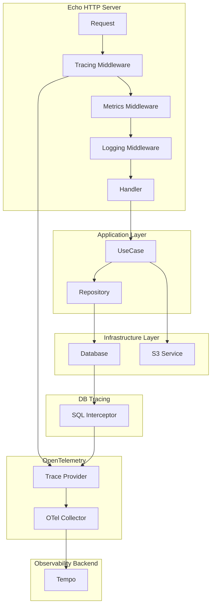

# 分散トレース計装 詳細設計書

- [分散トレース計装 詳細設計書](#分散トレース計装-詳細設計書)
  - [1. 概要](#1-概要)
    - [1.1. 背景と目的](#11-背景と目的)
    - [1.2. 対象範囲](#12-対象範囲)
    - [1.3. 設計方針](#13-設計方針)
  - [2. 現状分析](#2-現状分析)
    - [2.1. 既存実装状況](#21-既存実装状況)
    - [2.2. 課題・改善点](#22-課題改善点)
  - [3. トレース設計](#3-トレース設計)
    - [3.1. トレース対象API一覧](#31-トレース対象api一覧)
    - [3.2. スパン構造設計](#32-スパン構造設計)
      - [3.2.1. 基本的なスパン階層構造](#321-基本的なスパン階層構造)
      - [3.2.2. 具体例: 商品一覧取得のスパン構造](#322-具体例-商品一覧取得のスパン構造)
      - [3.2.3. 具体例: 画像アップロードのスパン構造](#323-具体例-画像アップロードのスパン構造)
    - [3.3. スパン属性設計](#33-スパン属性設計)
      - [3.3.1. HTTPスパン属性（OpenTelemetry Semantic Conventions準拠）](#331-httpスパン属性opentelemetry-semantic-conventions準拠)
      - [3.3.2. データベーススパン属性](#332-データベーススパン属性)
      - [3.3.3. ビジネスロジックスパン属性](#333-ビジネスロジックスパン属性)
      - [3.3.4. 外部サービススパン属性](#334-外部サービススパン属性)
    - [3.4. エラー情報設計](#34-エラー情報設計)
      - [3.4.1. エラースパン属性](#341-エラースパン属性)
      - [3.4.2. エラーイベント設計](#342-エラーイベント設計)
  - [4. 実装設計](#4-実装設計)
    - [4.1. アーキテクチャ図](#41-アーキテクチャ図)
    - [4.2. OTelManagerの拡張](#42-otelmanagerの拡張)
      - [4.2.1. 設定構造体の拡張](#421-設定構造体の拡張)
      - [4.2.2. OTelManagerの拡張](#422-otelmanagerの拡張)
    - [4.3. HTTPトレーシングミドルウェア](#43-httpトレーシングミドルウェア)
      - [4.3.1. トレーシングミドルウェア実装](#431-トレーシングミドルウェア実装)
      - [4.3.2. ミドルウェア追加（router.goの修正）](#432-ミドルウェア追加routergoの修正)
    - [4.4. データベーストレーシング](#44-データベーストレーシング)
      - [4.4.1. SQLBoilerトレーシング実装](#441-sqlboilerトレーシング実装)
      - [4.4.2. DBManager修正](#442-dbmanager修正)
    - [4.5. 各層でのトレーシング実装](#45-各層でのトレーシング実装)
      - [4.5.1. UseCase層のトレーシング](#451-usecase層のトレーシング)
      - [4.5.2. Repository層のトレーシング](#452-repository層のトレーシング)
      - [4.5.3. 外部サービス連携のトレーシング](#453-外部サービス連携のトレーシング)
  - [5. サンプリング戦略](#5-サンプリング戦略)
    - [5.1. サンプリング方式](#51-サンプリング方式)
      - [5.1.1. 動的サンプリング（将来拡張）](#511-動的サンプリング将来拡張)
    - [5.2. パフォーマンス考慮事項](#52-パフォーマンス考慮事項)
  - [6. 設定・管理](#6-設定管理)
    - [6.1. 設定ファイル拡張](#61-設定ファイル拡張)
      - [6.1.1. config.yaml の拡張](#611-configyaml-の拡張)
      - [6.1.2. 環境別設定例](#612-環境別設定例)
    - [6.2. 環境変数](#62-環境変数)
  - [7. 検証・テスト計画](#7-検証テスト計画)
    - [7.1. 単体テスト](#71-単体テスト)
      - [7.1.1. トレーシングミドルウェア テスト](#711-トレーシングミドルウェア-テスト)
      - [7.1.2. データベーストレーシング テスト](#712-データベーストレーシング-テスト)
    - [7.2. 統合テスト](#72-統合テスト)
      - [7.2.1. エンドツーエンド トレース検証](#721-エンドツーエンド-トレース検証)
    - [7.3. エンドツーエンドテスト](#73-エンドツーエンドテスト)
      - [7.3.1. Tempo連携テスト](#731-tempo連携テスト)
      - [7.3.2. 性能テスト](#732-性能テスト)
  - [8. 実装手順](#8-実装手順)
    - [8.1. フェーズ1: 基盤実装](#81-フェーズ1-基盤実装)
    - [8.2. フェーズ2: HTTPトレーシング](#82-フェーズ2-httpトレーシング)
    - [8.3. フェーズ3: データベーストレーシング](#83-フェーズ3-データベーストレーシング)
    - [8.4. フェーズ4: ビジネスロジックトレーシング](#84-フェーズ4-ビジネスロジックトレーシング)

## 1. 概要

### 1.1. 背景と目的

**背景**

- EコマースアプリケーションのGoバックエンド（Echo + SQLBoiler）で分散トレースが未実装
- 既存のOpenTelemetryログ・メトリクス基盤を活用してトレース機能を追加
- リクエスト処理フローの可視化とボトルネック特定が必要

**目的**

- HTTPリクエスト処理の全フローをトレースとして記録
- データベースクエリの実行状況を可視化
- エラー発生時の原因調査効率化
- パフォーマンス改善のためのボトルネック特定

### 1.2. 対象範囲

**対象システム**

- `backend-api` （Goアプリケーション）
- MySQL データベース
- OTel Collector → Tempo

**トレース対象**

- HTTPリクエスト/レスポンス
- データベースクエリ（SQLBoiler）
- ビジネスロジック実行（UseCase層）
- 外部サービス連携（S3）

**除外範囲**

- フロントエンド（Next.js）のトレーシング
- Lambda関数のトレーシング
- ログとメトリクスの既存実装変更

### 1.3. 設計方針

1. **既存アーキテクチャとの整合性**: DDD+クリーンアーキテクチャの層構造を尊重
2. **最小侵入**: 既存コードへの影響を最小化
3. **OpenTelemetry標準準拠**: セマンティック規約に従った属性設定
4. **パフォーマンス重視**: 本番環境での性能影響を最小化
5. **段階的実装**: 段階的にトレース範囲を拡張

## 2. 現状分析

### 2.1. 既存実装状況

**✅ 実装済み**

- OpenTelemetryの基盤設定（`observability_config.go`）
- OTelManagerによるログ・メトリクス初期化（`otel.go`）
- OTel Collectorの設定（トレースパイプライン含む）
- HTTPメトリクスミドルウェア
- 構造化ログミドルウェア
- リクエストIDミドルウェア

**❌ 未実装**

- トレースプロバイダーの初期化
- HTTPトレーシングミドルウェア
- データベーストレーシング
- ビジネスロジックレベルのスパン

### 2.2. 課題・改善点

| 項目                   | 現状           | 課題                       | 改善方針                                 |
| ---------------------- | -------------- | -------------------------- | ---------------------------------------- |
| **トレース基盤**       | 未実装         | トレース収集・送信機能なし | OTelManagerを拡張してTraceProviderを追加 |
| **HTTPトレーシング**   | メトリクスのみ | リクエストフローが不可視   | Echo用トレーシングミドルウェア実装       |
| **DBトレーシング**     | ログのみ       | クエリ実行状況が不可視     | SQLBoiler用トレースインターセプター実装  |
| **エラートレーシング** | ログのみ       | エラー文脈の追跡困難       | スパンエラー属性とイベント記録           |

## 3. トレース設計

### 3.1. トレース対象API一覧

| API エンドポイント          | HTTP メソッド | 操作種別 | 優先度 | トレース特徴                       |
| --------------------------- | ------------- | -------- | ------ | ---------------------------------- |
| `/health`                   | GET           | Read     | 高     | ヘルスチェック（DB接続確認含む）   |
| `/products`                 | GET           | Read     | 高     | 商品一覧（複数テーブル結合クエリ） |
| `/products/{id}`            | GET           | Read     | 高     | 商品詳細（複数テーブル結合）       |
| `/products/{id}/image`      | POST          | Write    | 中     | 画像アップロード（S3連携）         |
| `/products/{id}/image`      | GET           | Read     | 中     | 画像取得（S3連携）                 |
| `/categories`               | GET           | Read     | 中     | カテゴリー一覧                     |
| `/categories/{id}/products` | GET           | Read     | 中     | カテゴリー別商品（結合クエリ）     |

### 3.2. スパン構造設計

#### 3.2.1. 基本的なスパン階層構造

```
📊 HTTP Request Span (Root)                      [http.server]
├── 🔑 Authentication Span                       [custom.auth]
├── 📝 Validation Span                           [custom.validation]
├── 🏢 Business Logic Span (UseCase)             [custom.usecase]
│   ├── 📖 Repository Read Span                  [custom.repository]
│   │   └── 🗄️ Database Query Span               [db.query]
│   ├── 🔧 Domain Service Span                   [custom.domain_service]
│   └── 🌐 External Service Span (S3)            [http.client]
└── 📤 Response Mapping Span                     [custom.mapping]
```

#### 3.2.2. 具体例: 商品一覧取得のスパン構造

```
🌐 GET /products                                 (Root Span)
├── 📝 Parameter Validation
├── 🏢 List Products UseCase
│   ├── 📖 Product Catalog Reader
│   │   └── 🗄️ SELECT products p JOIN categories c...
│   └── 📄 Product List Mapper
└── 📤 JSON Response Serialization
```

#### 3.2.3. 具体例: 画像アップロードのスパン構造

```
🌐 POST /products/{id}/image                     (Root Span)
├── 📝 File Upload Validation
├── 🏢 Upload Product Image UseCase
│   ├── 📖 Product Repository (Existence Check)
│   │   └── 🗄️ SELECT * FROM products WHERE id = ?
│   ├── 🌐 S3 Upload Service
│   │   └── 🌐 PUT Object to S3
│   └── 📖 Update Product Repository
│       └── 🗄️ UPDATE products SET image_url = ? WHERE id = ?
└── 📤 Upload Response Mapping
```

### 3.3. スパン属性設計

#### 3.3.1. HTTPスパン属性（OpenTelemetry Semantic Conventions準拠）

| 属性名                         | 型     | 必須 | 例                                       | 説明                 |
| ------------------------------ | ------ | ---- | ---------------------------------------- | -------------------- |
| `http.method`                  | string | ✅    | `GET`                                    | HTTPメソッド         |
| `http.route`                   | string | ✅    | `/products/{id}`                         | ルートパターン       |
| `http.url`                     | string | ✅    | `http://localhost:8080/api/products/123` | リクエストURL        |
| `http.status_code`             | int    | ✅    | `200`                                    | HTTPステータスコード |
| `http.request_content_length`  | int    | ⭕    | `1024`                                   | リクエストサイズ     |
| `http.response_content_length` | int    | ⭕    | `2048`                                   | レスポンスサイズ     |
| `http.user_agent`              | string | ⭕    | `Mozilla/5.0...`                         | ユーザーエージェント |
| `user.id`                      | string | ⭕    | `user_123`                               | 認証ユーザーID       |

#### 3.3.2. データベーススパン属性

| 属性名                 | 型     | 必須 | 例                                    | 説明               |
| ---------------------- | ------ | ---- | ------------------------------------- | ------------------ |
| `db.system`            | string | ✅    | `mysql`                               | DBシステム         |
| `db.connection_string` | string | ⭕    | `mysql://localhost:3306/ecommerce`    | 接続文字列（秘匿） |
| `db.user`              | string | ⭕    | `ecommerce_user`                      | DBユーザー         |
| `db.name`              | string | ✅    | `ecommerce`                           | データベース名     |
| `db.statement`         | string | ✅    | `SELECT * FROM products WHERE id = ?` | SQLクエリ          |
| `db.operation`         | string | ✅    | `SELECT`                              | SQL操作種別        |
| `db.sql.table`         | string | ⭕    | `products`                            | 操作対象テーブル   |
| `db.rows_affected`     | int    | ⭕    | `5`                                   | 影響行数           |

#### 3.3.3. ビジネスロジックスパン属性

| 属性名                 | 型     | 必須 | 例                     | 説明             |
| ---------------------- | ------ | ---- | ---------------------- | ---------------- |
| `app.operation_name`   | string | ✅    | `upload_product_image` | 操作名           |
| `app.layer`            | string | ✅    | `usecase`              | アーキテクチャ層 |
| `app.domain`           | string | ✅    | `product`              | ドメイン名       |
| `app.entity_id`        | string | ⭕    | `product_123`          | エンティティID   |
| `app.business_context` | string | ⭕    | `catalog_management`   | ビジネス文脈     |

#### 3.3.4. 外部サービススパン属性

| 属性名          | 型     | 必須 | 例                                    | 説明               |
| --------------- | ------ | ---- | ------------------------------------- | ------------------ |
| `http.method`   | string | ✅    | `PUT`                                 | HTTPメソッド       |
| `http.url`      | string | ✅    | `https://s3.amazonaws.com/bucket/key` | 外部URL            |
| `rpc.service`   | string | ✅    | `aws.s3`                              | サービス名         |
| `aws.s3.bucket` | string | ⭕    | `ecommerce-images`                    | S3バケット名       |
| `aws.s3.key`    | string | ⭕    | `products/123/image.jpg`              | S3オブジェクトキー |

### 3.4. エラー情報設計

#### 3.4.1. エラースパン属性

| 属性名          | 型     | 説明                                       |
| --------------- | ------ | ------------------------------------------ |
| `error`         | bool   | エラー発生フラグ                           |
| `error.type`    | string | エラー種別（validation_error, db_error等） |
| `error.message` | string | エラーメッセージ                           |
| `error.stack`   | string | スタックトレース（開発環境のみ）           |

#### 3.4.2. エラーイベント設計

```go
// エラー情報をイベントとして記録
span.AddEvent("error", trace.WithAttributes(
    attribute.String("exception.type", "ValidationError"),
    attribute.String("exception.message", "Invalid product ID"),
    attribute.String("exception.stacktrace", stackTrace),
))
```

## 4. 実装設計

### 4.1. アーキテクチャ図



### 4.2. OTelManagerの拡張

#### 4.2.1. 設定構造体の拡張

```go
// observability_config.go に追加
type OTelTracingConfig struct {
    Enabled         bool          `mapstructure:"enabled"`
    SamplingRatio   float64       `mapstructure:"sampling_ratio"`
    BatchTimeout    time.Duration `mapstructure:"batch_timeout"`
    MaxQueueSize    int           `mapstructure:"max_queue_size"`
    MaxExportBatchSize int        `mapstructure:"max_export_batch_size"`
    ExportTimeout   time.Duration `mapstructure:"export_timeout"`
}

type OTelConfig struct {
    // 既存フィールド...
    Tracing OTelTracingConfig `mapstructure:"tracing"`
}
```

#### 4.2.2. OTelManagerの拡張

```go
// otel.go の修正
type OTelManager struct {
    loggerProvider *sdklog.LoggerProvider
    meterProvider  *sdkmetric.MeterProvider
    tracerProvider *sdktrace.TracerProvider  // 追加
    resource       *resource.Resource
    meter          metric.Meter
    tracer         trace.Tracer              // 追加
}

func NewOTelManager(otelConfig config.OTelConfig) (*OTelManager, error) {
    // 既存のログ・メトリクス初期化...

    // トレース初期化
    var tracerProvider *sdktrace.TracerProvider
    var tracer trace.Tracer

    if otelConfig.Tracing.Enabled {
        tracerProvider, err = initTracing(ctx, otelConfig, res)
        if err != nil {
            return nil, fmt.Errorf("failed to initialize tracing: %w", err)
        }
        otel.SetTracerProvider(tracerProvider)
        tracer = tracerProvider.Tracer(otelConfig.ServiceName)
    }

    return &OTelManager{
        // 既存フィールド...
        tracerProvider: tracerProvider,
        tracer:         tracer,
    }, nil
}

// トレース初期化関数
func initTracing(ctx context.Context, cfg config.OTelConfig, res *resource.Resource) (*sdktrace.TracerProvider, error) {
    // OTLP Trace Exporter
    traceExporter, err := otlptracehttp.New(ctx,
        otlptracehttp.WithEndpoint(cfg.Collector.Endpoint),
        otlptracehttp.WithTimeout(cfg.Tracing.ExportTimeout),
        otlptracehttp.WithCompression(otlptracehttp.GzipCompression),
        otlptracehttp.WithInsecure(), // 開発環境用
    )
    if err != nil {
        return nil, fmt.Errorf("failed to create tracer exporter: %w", err)
    }

    // サンプラーの設定
    sampler := sdktrace.TraceIDRatioBased(cfg.Tracing.SamplingRatio)

    // Trace Provider
    tp := sdktrace.NewTracerProvider(
        sdktrace.WithBatcher(traceExporter,
            sdktrace.WithBatchTimeout(cfg.Tracing.BatchTimeout),
            sdktrace.WithMaxQueueSize(cfg.Tracing.MaxQueueSize),
            sdktrace.WithMaxExportBatchSize(cfg.Tracing.MaxExportBatchSize),
        ),
        sdktrace.WithResource(res),
        sdktrace.WithSampler(sampler),
    )

    return tp, nil
}
```

### 4.3. HTTPトレーシングミドルウェア

#### 4.3.1. トレーシングミドルウェア実装

```go
// internal/shared/presentation/rest/middleware/tracing.go
package middleware

import (
    "fmt"
    "github.com/labstack/echo/v4"
    "go.opentelemetry.io/otel"
    "go.opentelemetry.io/otel/attribute"
    "go.opentelemetry.io/otel/codes"
    "go.opentelemetry.io/otel/propagation"
    "go.opentelemetry.io/otel/semconv/v1.24.0/httpconv"
    "go.opentelemetry.io/otel/trace"
)

// TracingMiddleware はHTTPリクエストのトレーシングミドルウェア
func TracingMiddleware() echo.MiddlewareFunc {
    return func(next echo.HandlerFunc) echo.HandlerFunc {
        return func(c echo.Context) error {
            // TracerProviderが設定されていない場合はスキップ
            if otel.GetTracerProvider() == nil {
                return next(c)
            }

            tracer := otel.Tracer("aws-observability-ecommerce")

            // トレースコンテキストの抽出
            ctx := otel.GetTextMapPropagator().Extract(
                c.Request().Context(),
                propagation.HeaderCarrier(c.Request().Header),
            )

            // スパン開始
            spanName := fmt.Sprintf("%s %s", c.Request().Method, getRoutePattern(c))
            ctx, span := tracer.Start(ctx, spanName, trace.WithSpanKind(trace.SpanKindServer))
            defer span.End()

            // コンテキストを設定
            c.SetRequest(c.Request().WithContext(ctx))

            // HTTP属性を設定
            span.SetAttributes(
                httpconv.HTTPMethod(c.Request().Method),
                httpconv.HTTPRoute(getRoutePattern(c)),
                httpconv.HTTPURL(c.Request().URL.String()),
                httpconv.HTTPScheme(c.Scheme()),
                httpconv.HTTPHost(c.Request().Host),
                httpconv.HTTPUserAgent(c.Request().UserAgent()),
                attribute.String("http.remote_addr", c.RealIP()),
            )

            // リクエストサイズ
            if c.Request().ContentLength > 0 {
                span.SetAttributes(httpconv.HTTPRequestContentLength(int(c.Request().ContentLength)))
            }

            // 次のハンドラーを実行
            err := next(c)

            // レスポンス属性を設定
            span.SetAttributes(httpconv.HTTPStatusCode(c.Response().Status))

            // エラーハンドリング
            if err != nil {
                span.RecordError(err)
                span.SetStatus(codes.Error, err.Error())
                span.SetAttributes(attribute.Bool("error", true))
            } else if c.Response().Status >= 400 {
                span.SetStatus(codes.Error, fmt.Sprintf("HTTP %d", c.Response().Status))
                span.SetAttributes(attribute.Bool("error", true))
            }

            return err
        }
    }
}

func getRoutePattern(c echo.Context) string {
    if route := c.Path(); route != "" {
        return route
    }
    return c.Request().URL.Path
}
```

#### 4.3.2. ミドルウェア追加（router.goの修正）

```go
// router.go の setupMiddleware() を修正
func (r *Router) setupMiddleware() {
    // 基本的なミドルウェア
    r.echo.Use(middleware.Recover())
    r.echo.Use(middleware.CORS())

    // トレーシングミドルウェア（早期に配置）
    r.echo.Use(customMiddleware.TracingMiddleware())

    // 既存ミドルウェア
    r.echo.Use(customMiddleware.HTTPMetricsMiddleware())
    r.echo.Use(customMiddleware.RequestIDMiddleware())
    r.echo.Use(customMiddleware.LoggingMiddleware())
    r.echo.Use(customMiddleware.ErrorHandlingMiddleware())
}
```

### 4.4. データベーストレーシング

#### 4.4.1. SQLBoilerトレーシング実装

```go
// internal/shared/infrastructure/database/tracing.go
package database

import (
    "context"
    "database/sql"
    "database/sql/driver"
    "fmt"
    "time"

    "go.opentelemetry.io/otel"
    "go.opentelemetry.io/otel/attribute"
    "go.opentelemetry.io/otel/codes"
    "go.opentelemetry.io/otel/semconv/v1.24.0/dbconv"
    "go.opentelemetry.io/otel/trace"
)

// TracingWrapper はデータベース接続のトレーシングラッパー
type TracingWrapper struct {
    *sql.DB
    dbName string
}

// NewTracingWrapper はトレーシング対応のDB接続を作成
func NewTracingWrapper(db *sql.DB, dbName string) *TracingWrapper {
    return &TracingWrapper{
        DB:     db,
        dbName: dbName,
    }
}

// QueryContext はクエリ実行をトレース
func (tw *TracingWrapper) QueryContext(ctx context.Context, query string, args ...interface{}) (*sql.Rows, error) {
    return tw.traceQuery(ctx, query, args, func() (*sql.Rows, error) {
        return tw.DB.QueryContext(ctx, query, args...)
    })
}

// ExecContext は実行をトレース
func (tw *TracingWrapper) ExecContext(ctx context.Context, query string, args ...interface{}) (sql.Result, error) {
    return tw.traceExec(ctx, query, args, func() (sql.Result, error) {
        return tw.DB.ExecContext(ctx, query, args...)
    })
}

func (tw *TracingWrapper) traceQuery(ctx context.Context, query string, args []interface{}, fn func() (*sql.Rows, error)) (*sql.Rows, error) {
    tracer := otel.Tracer("aws-observability-ecommerce")

    ctx, span := tracer.Start(ctx, "db.query", trace.WithSpanKind(trace.SpanKindClient))
    defer span.End()

    // DB属性を設定
    span.SetAttributes(
        dbconv.DBSystemMySQL,
        dbconv.DBName(tw.dbName),
        dbconv.DBStatement(query),
        dbconv.DBOperation(extractOperation(query)),
        attribute.String("db.sql.table", extractTable(query)),
    )

    start := time.Now()
    rows, err := fn()
    duration := time.Since(start)

    span.SetAttributes(attribute.Int64("db.duration_ms", duration.Milliseconds()))

    if err != nil {
        span.RecordError(err)
        span.SetStatus(codes.Error, err.Error())
    }

    return rows, err
}

func (tw *TracingWrapper) traceExec(ctx context.Context, query string, args []interface{}, fn func() (sql.Result, error)) (sql.Result, error) {
    tracer := otel.Tracer("aws-observability-ecommerce")

    ctx, span := tracer.Start(ctx, "db.exec", trace.WithSpanKind(trace.SpanKindClient))
    defer span.End()

    // DB属性を設定
    span.SetAttributes(
        dbconv.DBSystemMySQL,
        dbconv.DBName(tw.dbName),
        dbconv.DBStatement(query),
        dbconv.DBOperation(extractOperation(query)),
        attribute.String("db.sql.table", extractTable(query)),
    )

    start := time.Now()
    result, err := fn()
    duration := time.Since(start)

    span.SetAttributes(attribute.Int64("db.duration_ms", duration.Milliseconds()))

    if err != nil {
        span.RecordError(err)
        span.SetStatus(codes.Error, err.Error())
    } else if result != nil {
        if rowsAffected, err := result.RowsAffected(); err == nil {
            span.SetAttributes(attribute.Int64("db.rows_affected", rowsAffected))
        }
    }

    return result, err
}

// extractOperation はSQLクエリから操作種別を抽出
func extractOperation(query string) string {
    if len(query) < 6 {
        return "unknown"
    }
    return strings.ToUpper(strings.Split(strings.TrimSpace(query), " ")[0])
}

// extractTable はSQLクエリからテーブル名を抽出（簡易版）
func extractTable(query string) string {
    // 簡易的な実装（本格的にはSQLパーサーが必要）
    query = strings.ToLower(strings.TrimSpace(query))

    if strings.HasPrefix(query, "select") {
        if idx := strings.Index(query, "from "); idx != -1 {
            parts := strings.Fields(query[idx+5:])
            if len(parts) > 0 {
                return strings.Trim(parts[0], "`")
            }
        }
    } else if strings.HasPrefix(query, "insert into ") {
        parts := strings.Fields(query[12:])
        if len(parts) > 0 {
            return strings.Trim(parts[0], "`")
        }
    } else if strings.HasPrefix(query, "update ") {
        parts := strings.Fields(query[7:])
        if len(parts) > 0 {
            return strings.Trim(parts[0], "`")
        }
    } else if strings.HasPrefix(query, "delete from ") {
        parts := strings.Fields(query[12:])
        if len(parts) > 0 {
            return strings.Trim(parts[0], "`")
        }
    }

    return "unknown"
}
```

#### 4.4.2. DBManager修正

```go
// connection.go の修正
func NewDBManager(dbConfig config.DatabaseConfig) (*DBManager, error) {
    // 既存のDB接続処理...

    // トレーシングラッパーを適用
    tracingDB := NewTracingWrapper(db, dbConfig.Name)

    return &DBManager{db: tracingDB.DB}, nil
}
```

### 4.5. 各層でのトレーシング実装

#### 4.5.1. UseCase層のトレーシング

```go
// product/application/usecase/upload_product_image.go の修正例
func (uc *UploadProductImageUseCase) Execute(ctx context.Context, req *dto.UploadImageRequest) (*dto.UploadImageResponse, error) {
    tracer := otel.Tracer("aws-observability-ecommerce")

    ctx, span := tracer.Start(ctx, "usecase.upload_product_image", trace.WithAttributes(
        attribute.String("app.layer", "usecase"),
        attribute.String("app.domain", "product"),
        attribute.String("app.operation_name", "upload_product_image"),
        attribute.Int64("app.entity_id", req.ProductID),
        attribute.String("app.filename", req.Filename),
        attribute.Int("app.file_size_bytes", len(req.ImageData)),
    ))
    defer span.End()

    // ビジネスロジック実行...

    if err != nil {
        span.RecordError(err)
        span.SetStatus(codes.Error, err.Error())
        span.SetAttributes(attribute.String("error.type", "business_logic_error"))
    }

    return response, err
}
```

#### 4.5.2. Repository層のトレーシング

```go
// product/infrastructure/persistence/repository の修正例
func (r *ProductRepositoryImpl) Save(ctx context.Context, product *entity.Product) error {
    tracer := otel.Tracer("aws-observability-ecommerce")

    ctx, span := tracer.Start(ctx, "repository.save_product", trace.WithAttributes(
        attribute.String("app.layer", "repository"),
        attribute.String("app.operation", "save"),
        attribute.String("app.entity_type", "product"),
        attribute.String("app.entity_id", product.ID().String()),
    ))
    defer span.End()

    // データベース操作（自動的にDBトレーシングが適用される）

    return err
}
```

#### 4.5.3. 外部サービス連携のトレーシング

```go
// product/infrastructure/external/storage/s3_image_storage_impl.go の修正例
func (s *S3ImageStorageImpl) Upload(ctx context.Context, key string, data []byte) (string, error) {
    tracer := otel.Tracer("aws-observability-ecommerce")

    ctx, span := tracer.Start(ctx, "s3.upload", trace.WithAttributes(
        attribute.String("rpc.service", "aws.s3"),
        attribute.String("aws.s3.bucket", s.bucketName),
        attribute.String("aws.s3.key", key),
        attribute.Int("aws.s3.object_size", len(data)),
    ))
    defer span.End()

    // S3アップロード処理...

    if err != nil {
        span.RecordError(err)
        span.SetStatus(codes.Error, err.Error())
    }

    return url, err
}
```

## 5. サンプリング戦略

### 5.1. サンプリング方式

| 環境                 | サンプリング戦略 | 設定値       | 理由                   |
| -------------------- | ---------------- | ------------ | ---------------------- |
| **開発環境**         | 全サンプリング   | `1.0` (100%) | 開発・デバッグ用       |
| **ステージング環境** | Ratio Based      | `0.1` (10%)  | 負荷テスト時の性能確認 |
| **本番環境**         | Ratio Based      | `0.01` (1%)  | 本番パフォーマンス維持 |

#### 5.1.1. 動的サンプリング（将来拡張）

```go
// 将来的な実装: エラー時は高サンプリング
type AdaptiveSampler struct {
    baseSampler trace.Sampler
    errorSampler trace.Sampler
}

func (s *AdaptiveSampler) ShouldSample(parameters trace.SamplingParameters) trace.SamplingResult {
    // エラー検出時は高サンプリング
    if isErrorContext(parameters.Attributes) {
        return s.errorSampler.ShouldSample(parameters)
    }
    return s.baseSampler.ShouldSample(parameters)
}
```

### 5.2. パフォーマンス考慮事項

| 項目               | 対策                               | 期待効果   |
| ------------------ | ---------------------------------- | ---------- |
| **CPU使用率**      | バッチエクスポート、軽量属性       | +2-5% 以内 |
| **メモリ使用量**   | キューサイズ制限、タイムアウト設定 | +10MB以内  |
| **ネットワーク**   | 圧縮、バッチ送信                   | 最小化     |
| **レスポンス時間** | 非同期エクスポート                 | 影響なし   |

## 6. 設定・管理

### 6.1. 設定ファイル拡張

#### 6.1.1. config.yaml の拡張

```yaml
observability:
  otel:
    service_name: "aws-observability-ecommerce"
    service_version: "1.0.0"
    service_namespace: "ecommerce"
    deployment_environment: "development"

    collector:
      endpoint: "otel-collector:4318"
      timeout: "10s"
      retry_enabled: true
      compression: "gzip"

    # 新規追加: トレーシング設定
    tracing:
      enabled: true
      sampling_ratio: 1.0            # 開発環境: 100%
      batch_timeout: "1s"
      max_queue_size: 2048
      max_export_batch_size: 512
      export_timeout: "30s"
```

#### 6.1.2. 環境別設定例

**開発環境（config.dev.yaml）**

```yaml
observability:
  otel:
    tracing:
      enabled: true
      sampling_ratio: 1.0            # 全サンプリング
```

**本番環境（config.prod.yaml）**

```yaml
observability:
  otel:
    tracing:
      enabled: true
      sampling_ratio: 0.01           # 1%サンプリング
```

### 6.2. 環境変数

| 環境変数名                   | 説明                     | デフォルト | 例     |
| ---------------------------- | ------------------------ | ---------- | ------ |
| `OTEL_TRACES_ENABLED`        | トレース有効化           | `true`     | `true` |
| `OTEL_TRACES_SAMPLING_RATIO` | サンプリング比率         | `1.0`      | `0.01` |
| `OTEL_TRACES_BATCH_TIMEOUT`  | バッチタイムアウト       | `1s`       | `5s`   |
| `OTEL_TRACES_MAX_QUEUE_SIZE` | キューサイズ             | `2048`     | `1024` |
| `OTEL_TRACES_EXPORT_TIMEOUT` | エクスポートタイムアウト | `30s`      | `60s`  |

## 7. 検証・テスト計画

### 7.1. 単体テスト

#### 7.1.1. トレーシングミドルウェア テスト

```go
func TestTracingMiddleware(t *testing.T) {
    tests := []struct {
        name         string
        method       string
        path         string
        expectedSpan bool
    }{
        {"GET request", "GET", "/products", true},
        {"POST request", "POST", "/products/1/image", true},
        {"Error request", "GET", "/non-existent", true},
    }

    for _, tt := range tests {
        t.Run(tt.name, func(t *testing.T) {
            // テスト実装...
        })
    }
}
```

#### 7.1.2. データベーストレーシング テスト

```go
func TestDatabaseTracing(t *testing.T) {
    // スパン収集用のテストエクスポーター
    exporter := tracetest.NewInMemoryExporter()

    // テスト用TracerProvider
    tp := sdktrace.NewTracerProvider(
        sdktrace.WithSyncer(exporter),
    )
    otel.SetTracerProvider(tp)

    // データベース操作実行
    ctx := context.Background()
    rows, err := tracingDB.QueryContext(ctx, "SELECT * FROM products WHERE id = ?", 1)

    // スパンの検証
    spans := exporter.GetSpans()
    assert.Len(t, spans, 1)
    assert.Equal(t, "db.query", spans[0].Name)
    assert.Contains(t, spans[0].Attributes, attribute.String("db.system", "mysql"))
}
```

### 7.2. 統合テスト

#### 7.2.1. エンドツーエンド トレース検証

```go
func TestEndToEndTracing(t *testing.T) {
    // APIリクエスト実行
    resp := httptest.NewRequest("GET", "/api/products/1", nil)

    // トレース検証
    // 1. HTTPスパンの存在確認
    // 2. UseCaseスパンの存在確認
    // 3. データベーススパンの存在確認
    // 4. スパン階層構造の確認
    // 5. 属性の正確性確認
}
```

### 7.3. エンドツーエンドテスト

#### 7.3.1. Tempo連携テスト

1. **Tempo確認**: Grafana UIでトレース表示確認
2. **サービスマップ**: サービス間の関係確認
3. **クエリ検索**: トレースIDでの検索確認
4. **パフォーマンス**: レスポンス時間への影響確認

#### 7.3.2. 性能テスト

```bash
# 負荷テストスクリプト例
for i in {1..1000}; do
  curl -X GET "http://localhost:8080/api/products" &
done
wait

# CPU・メモリ使用量の確認
docker stats backend-api
```

## 8. 実装手順

### 8.1. フェーズ1: 基盤実装

**目標**: トレース基盤の構築と初期動作確認

**作業項目**:

1. ✅ **設定拡張**
   - `observability_config.go` にトレース設定追加
   - 環境変数バインディング追加
   - デフォルト値設定

2. ✅ **OTelManager拡張**
   - TraceProvider初期化機能追加
   - OTLP Trace Exporter設定
   - サンプラー設定

3. ✅ **基本テスト**
   - トレース初期化テスト
   - 設定読み込みテスト
   - Collector接続テスト

**成功基準**:

- [ ] トレースプロバイダーが正常に初期化される
- [ ] OTel Collectorとの接続が確立される
- [ ] Tempoでトレースデータが受信される

### 8.2. フェーズ2: HTTPトレーシング

**目標**: HTTPリクエスト・レスポンスのトレーシング実装

**作業項目**:

1. ✅ **トレーシングミドルウェア実装**
   - HTTPスパン生成
   - OpenTelemetry Semantic Conventions準拠
   - エラーハンドリング

2. ✅ **ミドルウェア統合**
   - router.goでの有効化
   - 既存ミドルウェアとの順序調整

3. ✅ **動作確認**
   - 各APIエンドポイントでのトレース確認
   - エラー時のトレース確認

**成功基準**:

- [ ] 全APIエンドポイントでHTTPスパンが生成される
- [ ] 適切な属性が設定される
- [ ] エラー時に適切なステータスが設定される
- [ ] Grafanaでトレースが表示される

### 8.3. フェーズ3: データベーストレーシング

**目標**: データベースクエリのトレーシング実装

**作業項目**:

1. ✅ **DBトレーシング実装**
   - TracingWrapper作成
   - SQLクエリのスパン生成
   - パフォーマンス情報記録

2. ✅ **DBManager統合**
   - connection.goでのラッパー適用
   - SQLBoilerとの連携確認

3. ✅ **動作確認**
   - CRUD操作でのトレース確認
   - クエリ実行時間記録確認

**成功基準**:

- [ ] 全データベースクエリでスパンが生成される
- [ ] クエリ文とパフォーマンス情報が記録される
- [ ] HTTPスパンとDBスパンの親子関係が正しい

### 8.4. フェーズ4: ビジネスロジックトレーシング

**目標**: UseCase・Repository・外部サービス連携のトレーシング実装

**作業項目**:

1. ✅ **UseCase層トレーシング**
   - 主要UseCaseへのスパン追加
   - ビジネス属性の設定

2. ✅ **Repository層トレーシング**
   - Repository操作のスパン追加
   - エンティティ情報の記録

3. ✅ **外部サービストレーシング**
   - S3操作のスパン追加
   - AWS API呼び出しの記録

4. ✅ **エンドツーエンドテスト**
   - 完全なトレースフローの確認
   - サービスマップの確認

**成功基準**:

- [ ] ビジネスロジックレベルでの詳細なトレースが取得できる
- [ ] サービスマップで処理フローが可視化される
- [ ] エラー発生時の原因特定が効率化される
- [ ] パフォーマンスボトルネックが特定可能になる

---

**最終成果物**:

- ✅ 完全に動作する分散トレースシステム
- ✅ Grafana Tempoでのトレース可視化
- ✅ 運用に必要なドキュメント・手順書
- ✅ 性能影響の検証結果

この設計書に基づいて段階的に実装を進めることで、既存システムへの影響を最小化しながら、効果的な分散トレーシング機能を構築できます。
